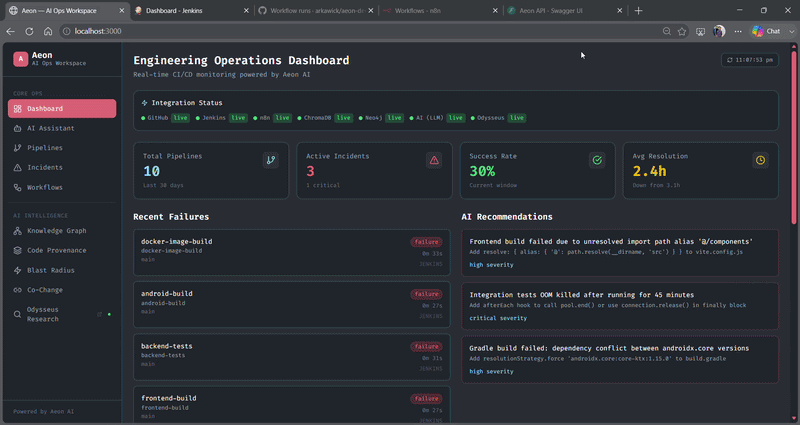

# Aeon — AI-Powered Engineering Operations Workspace

> Every incident your team has ever seen. Every failure that's coming next. One workspace.

**"Odysseus for DevOps"** — an AI ops workspace that combines GitHub Actions, Jenkins, n8n, persistent incident memory (ChromaDB + Neo4j), and a LangGraph agent for CI/CD root cause analysis, automated remediation, and deep code intelligence.



---

## What it does

When a build fails, Aeon doesn't just show you the error. It:

1. **Remembers** — searches every incident your team has ever seen using semantic vector search
2. **Diagnoses** — streams live tool calls (fetch logs → search memory → query graph) with per-token SSE
3. **Matches** — "This matches incident #421 from 3 weeks ago · 94% similar"
4. **Acts** — auto-creates GitHub issues, proposes PRs (with human-in-the-loop approval)
5. **Learns** — writes every new analysis back to memory so the AI gets smarter over time

And beyond incident response, two AI intelligence features answer the hardest questions in any codebase:

- **"Why is this code the way it is?"** → Code Provenance: traces commits → PRs → issues with AI evolution narrative
- **"What breaks if I merge this?"** → Blast Radius: maps every changed file to impacted services with AI risk assessment

---

## Demo Flow

### Incident Response
```
Push to GitHub / Jenkins build runs
        ↓
Aeon Pipelines page shows failure in real time
        ↓
Ask AI: "Why did the Android build fail?"
        ↓
Agent streams live tool calls (search_memory → fetch_logs → query_graph)
        ↓
Root cause identified · 91% confidence
"Matches incident #421 from 3 weeks ago"
Suggested fix included
        ↓
Click "Create Issue"  →  GitHub issue created live
Click "Approve PR"    →  PR created (human in the loop)
        ↓
Incident stored in memory — AI improves for next time
```

### Code Provenance
```
Enter: public GitHub repo + file path
        ↓
Aeon traces commit history → linked PRs → linked issues
        ↓
Graph renders: File → Commits → PRs → Issues → Developers
        ↓
AI Evolution Narrative: "Why is this file the way it is today?"
        ↓
Click any commit → see actual diff (added/removed lines)
Toggle Timeline layout → commits ordered chronologically left→right
```

### Blast Radius
```
Enter: public GitHub repo + PR number
        ↓
Aeon fetches all changed files from GitHub API
        ↓
Classifies each: Service / Test / Config / Pipeline / Infra / Dependencies
        ↓
Radial graph: PR at center → files → impacted areas spreading outward
        ↓
AI risk assessment: HIGH / MEDIUM / LOW
+ deploy recommendation + "must verify" checklist
```

---

## Features

| Feature | Description |
|---|---|
| **AI Assistant** | Streaming LangGraph agent with live tool call log, confidence scores, memory match cards |
| **Deep Research mode** | 15-iteration exhaustive investigation — contributing factors, impact, action items |
| **Post-mortem generator** | One-click incident post-mortem report, copy or download as `.md` |
| **Incident Memory** | Two-stage retrieval — ChromaDB vector recall → weighted re-rank (cosine + field agreement + recency) with "why it matched" reasons, then **GraphRAG** expansion through Neo4j (error type → proven fixes → sibling incidents) injected into the agent's prompt |
| **Knowledge Graph** | Force-directed Neo4j visualization — incident → error type → fix relationships |
| **Code Provenance** | Trace any file's full history: commits → PRs → issues, per-node AI reasoning, real diffs, timeline layout |
| **Blast Radius** | Map what breaks when a PR merges: files → services, AI risk level + deploy recommendation |
| **Pipelines** | Unified GitHub Actions + Jenkins view, auto-refresh every 30s |
| **Workflows** | n8n workflow triggers from the dashboard |
| **Action Engine** | Auto GitHub issue creation; PR proposals with approve/reject UI |

---

## Architecture

```
              Browser  (React + Vite + Tailwind)
                            │
                   FastAPI Backend :8000
                            │
          ┌─────────────────┼──────────────────┐
          ↓                 ↓                  ↓
      GitHub API       Jenkins API        n8n Webhooks
          │                 │
          │        LangGraph Agent
          │   (Azure OpenAI or Claude —
          │    provider-agnostic layer)
          │         8 tools · astream()
          │                 │
          │     ┌───────────┴───────────┐
          │     ↓                       ↓
          │  ChromaDB                Neo4j
          │ (vector search)    (graph relationships)
          │
    ┌─────┴──────────────────────┐
    ↓                            ↓
provenance_service.py     blast_radius_service.py
 (Code Provenance)          (Blast Radius)
 commits→PRs→issues→AI      files→services→AI risk
```

---

## Tech Stack

| Layer | Technology |
|---|---|
| Backend | FastAPI (Python 3.11) |
| LLM | **Provider-agnostic** (`core/llm.py`): Azure OpenAI (`gpt-5-mini`) **or** Claude (`claude-sonnet-4-6`) — auto-detected, tool-calling on both, falls back to mock |
| Agent | LangGraph — StateGraph, `astream()`, 8 tools, provider-agnostic `run_turn()` |
| Retrieval | Two-stage: ChromaDB vector recall → weighted re-rank + GraphRAG graph expansion |
| Vector Memory | ChromaDB |
| Graph Memory | Neo4j (self-healing connection) |
| Structured DB | PostgreSQL |
| Cache | Redis |
| Frontend | React 18 + Vite + Tailwind CSS (Fira Code theme) |
| Graph Visualization | react-force-graph-2d |
| CI/CD | Jenkins (Docker) + GitHub Actions |
| Workflow Automation | n8n |
| Deployment | Docker Compose (8 services) |

---

## Quick Start

**Prerequisites:** Docker Desktop. An LLM key (Azure OpenAI **or** Anthropic) is optional — every AI surface falls back to mock output without one.

```bash
# 1. Clone
git clone https://github.com/YOUR_USERNAME/Project-Aeon.git
cd Project-Aeon

# 2. Configure
cp aeon/backend/.env.example aeon/backend/.env
# Edit aeon/backend/.env — set GITHUB_TOKEN and ONE of:
#   AZURE_OPENAI_ENDPOINT + AZURE_OPENAI_API_KEY   (Azure wins if both set)
#   ANTHROPIC_API_KEY

# 3. Start
cd aeon
docker compose up -d

# 4. Seed demo data (5 incidents + inc_demo_421 for Blast Radius recall)
curl -X POST http://localhost:8000/api/memory/seed
# or, from the repo root:  .\reseed.ps1

# 5. Open
# http://localhost:3000
```

---

## Environment Variables

The LLM layer auto-detects a provider: if `AZURE_OPENAI_*` is set it wins, else `ANTHROPIC_API_KEY`, else mock. Set `LLM_PROVIDER=azure|anthropic|mock` to force one.

```env
# --- LLM provider (pick one; Azure takes priority if both are set) ---
# Azure OpenAI — AZURE_OPENAI_ENDPOINT is the FULL chat-completions URL
AZURE_OPENAI_ENDPOINT=https://<gateway>/deployments/gpt-5-mini/chat/completions?api-version=2024-12-01-preview
AZURE_OPENAI_DEPLOYMENT=gpt-5-mini
AZURE_OPENAI_API_VERSION=2024-12-01-preview
AZURE_OPENAI_API_KEY=...
# ...or Anthropic
ANTHROPIC_API_KEY=sk-ant-...

GITHUB_TOKEN=ghp_...           # Required for Code Provenance + Blast Radius
```

After editing `.env` (env changes need a recreate, not a restart):
```bash
docker compose up -d backend
```

---

## Services

| Service | URL | Credentials |
|---|---|---|
| **Aeon UI** | http://localhost:3000 | — |
| **Backend API** | http://localhost:8000 | — |
| **API Docs** | http://localhost:8000/docs | — |
| **Jenkins** | http://localhost:8088 | admin / admin |
| **n8n** | http://localhost:5678 | — |
| **Neo4j** | http://localhost:7474 | neo4j / aeon_neo4j |
| **ChromaDB** | http://localhost:8001 | — |

---

## LangGraph Agent

```python
tools = [
    search_chromadb_memory,   # semantic search over past incidents
    query_neo4j_graph,        # relationship traversal
    fetch_github_logs,        # GitHub Actions run logs
    fetch_jenkins_logs,       # Jenkins build console output
    create_github_issue,      # auto-create issues
    create_github_pr,         # propose PRs (human approval required)
    trigger_jenkins_build,    # trigger rebuilds
    trigger_n8n_workflow,     # fire n8n automations
]
```

```
search_memory → call_claude → execute_tools (loop, up to 15×) → synthesize → memory_writer
```

The loop is **provider-agnostic** — `search_memory` also auto-fetches the failing Jenkins log to ground the first turn, and `call_claude` runs `llm.run_turn()`, which does real tool-calling on **either** Azure OpenAI or Anthropic (neutral Anthropic-shaped messages/tools are translated to OpenAI format for Azure). Every analysis is automatically written back to ChromaDB + Neo4j so the agent improves over time.

---

## Project Structure

```
Project-Aeon/
├── aeon/
│   ├── backend/
│   │   ├── api/
│   │   │   ├── pipelines.py, incidents.py, ai.py, memory.py
│   │   │   ├── provenance.py        ← Code Provenance API
│   │   │   └── blast_radius.py      ← Blast Radius API
│   │   ├── agents/                  LangGraph graph + 8 tools
│   │   ├── core/
│   │   │   ├── instances.py         Shared singletons
│   │   │   └── llm.py               ← Provider-agnostic LLM (Azure/Anthropic/mock)
│   │   ├── memory/                  ChromaDB + Neo4j (self-healing) stores
│   │   └── services/
│   │       ├── rerank.py                ← Two-stage retrieval re-rank
│   │       ├── graphrag.py              ← GraphRAG graph expansion
│   │       ├── provenance_service.py    ← GitHub trace + AI narrative
│   │       └── blast_radius_service.py  ← PR classifier + AI risk
│   ├── frontend/src/
│   │   ├── pages/
│   │   │   ├── Dashboard, AIAssistant, Pipelines, Incidents, Workflows
│   │   │   ├── GraphView.jsx        ← Knowledge Graph
│   │   │   ├── Provenance.jsx       ← Code Provenance
│   │   │   └── BlastRadius.jsx      ← Blast Radius
│   │   └── components/Sidebar.jsx
│   ├── docker-compose.yml
│   ├── CODE_PROVENANCE.md           ← Code Provenance guide
│   └── BLAST_RADIUS.md              ← Blast Radius guide
├── jenkins-setup/                   10 Jenkinsfile demos + seed script
├── github-actions-setup/            10 workflow YAMLs + setup script
├── n8n-setup/                       10 workflow JSONs
├── reseed.ps1                       Restore demo memory after a volume wipe
├── AEON_README.md                   Full technical reference
└── DEMO.md                          90-second demo runbook
```

---

## Key Design Decisions

- **`core/instances.py`** — shared singletons, no duplicate DB connections per request
- **Provider-agnostic LLM (`core/llm.py`)** — Azure OpenAI → Anthropic → mock, chosen at runtime; `run_turn()` gives the agent real tool-calling on both providers, `complete()` serves the single-shot surfaces (blast/provenance/co-change/post-mortem)
- **Two-stage retrieval + GraphRAG** — vector recall is re-ranked by field agreement + recency (`services/rerank.py`), then expanded through the incident graph (`services/graphrag.py`) so the model reasons over relationships, not just vector hits
- **SSE everywhere** — AI Assistant, Code Provenance, and Blast Radius all stream progress live; the UI never blocks
- **`memory_writer_node`** — every analysis auto-stored; the agent gets smarter with every run (write-backs are excluded from grounding recall so it never cites its own past output)
- **Human-in-the-loop PRs** — issues auto-create, PRs require explicit approval click
- **Resilient by design** — Neo4j self-heals the cold-start race (`_ensure_driver`, throttled reconnect); ChromaDB persists to `/data` so memory survives restarts; `reseed.ps1` restores demo memory after a `down -v`
- **`originalGraph` ref pattern** — ForceGraph2D mutates node objects in place; storing immutable server data separately prevents ghost traces on layout switch
- **Mock fallback everywhere** — full demo works without any external API tokens
